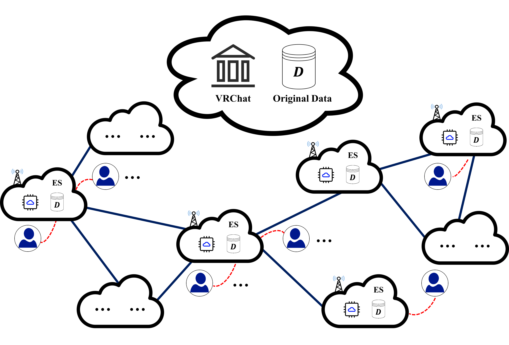

# Edge data integrity checking

This is the companion source code page for our paper on edge data integrity checking.

Edge computing is a distributed computing concept that allows Service Vendor (SV) to build a highly available network with minimal delay to provide services and process data in real-time.
It has been rapidly developed and applied in recent years. SV can deploy its services in edge servers to better meet user needs.
However, SV spends great efforts to build their distributed service network but face many challenges. Like classic cloud data integrity issues, every edge server(ES) faces the risk of data corruption.
For a large number of edge servers that may be malicious, how to ensure the integrity of all edge data and locate the damaged data is an urgent concern for SV.

In this article, we give the security definition of edge data integrity(EDI) audit problems and propose a new efficient and effective EDI audit paradigm.
In particular, we have grasped the connection and key differences between the classic cloud data integrity(CDI) and the EDI.
Thanks to this finding, we have given a general audit paradigm to solve the EDI problem.
Following EDI audit paradigm, SV can quickly audit the data integrity of all edge servers and locate damaged data in an untrusted ES environment.
To demonstrate the advantages of the EDI audit paradigm, we give a specific fast and light EDI audit protocol(EDC-L).EDC-L does not need to perform complex exponential operations or large integer operations and works in a computationally efficient Galois Field.
In addition, under a higher-level definition of security, we also provide another efficient and robust audit scheme (EDC-R).
It can prevent collusion between malicious edge servers.
Besides, we give proof of the correctness of the scheme under the standard security definition.
The experimental results show that our solution is more efficient and safer than the state-of-art.

More details can be found in the draft of our [paper](https://jquanstorage-1302225808.cos.ap-guangzhou.myqcloud.com/myfile/edgechecking_review.pdf), which is under further revision.

# Build

We use java 1.8.0_202 to develop this project and use IntelliJ IDEA and Maven to compile and manage it. 

The code for the EDC-R scheme and  comparative experiment are stored in other branchs of this repository.

# Usage

There are two ways to run the program. If you are using IDEA for Java development, you can run it as follows:

1. Import our source code project into IDEA. Try the menu “File -> New ->  Projects from existing sources” or create a blank project, and then import the project as a new module.
2. Replace the variable value to modify the file path for outputting experimental results.
3. Locate the file “Benchmark.java” which is the entrance of the whole program.
4. When the program runs, you need to enter some system parameters at the prompt in the console, including: *filePath*， *replicaPath*， *esNum*， *SECTOR_NUMBER*，*EXPERIMENT_TIME*. 
5. The benchmark process will be output in the console window.

If you are used to compile a java program in the command line, you can run it as follows:

1. Unzip the source code. Find all source codes in the directory “../src/”, compile all the source code.
2. Locate the file “Benchmark.java” which is the entrance of the whole program.
3. Other considerations are similar to using IDEA to start a project.
4. The performance result will be output in the console window.

